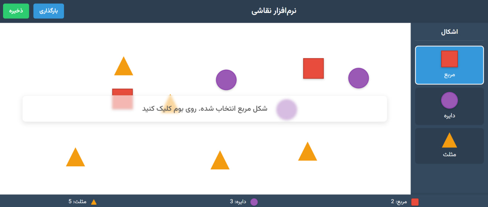

# پروژه نرم‌افزار نقاشی

این پروژه یک نرم‌افزار ساده نقاشی است که با استفاده از کتابخانه React پیاده‌سازی شده. کاربران می‌توانند با انتخاب اشکال هندسی (مربع، دایره، مثلث) و کلیک روی بوم (canvas) یا کشیدن (drag & drop) آن‌ها، اشکال را روی بوم رسم کنند. همچنین امکان ذخیره‌سازی و بارگذاری طرح نیز فراهم شده است.

<p align="center">  
    
</p>

برای اجرای این پروژه کافی است ابتدا با استفاده از دستور `npm install`، وابستگی‌های مورد نیاز را نصب کنید و سپس آن را با استفاده از `npm run` اجرا کنید. این پروژه به صورت پیش‌فرض از آدرس زیر در دسترس خواهد بود:

http://localhost:3000/

## منطق و عملکرد اجزای اصلی
### حالت‌ها (States)
```jsx
const [shapes, setShapes] = useState([]);
const [selectedShape, setSelectedShape] = useState(null);
const [draggingShape, setDraggingShape] = useState(null);
```

- حالت shapes: لیستی از اشکال رسم‌شده روی بوم
- حالت selectedShape: شکلی که کاربر انتخاب کرده برای رسم
- حالت draggingShape: شکلی که در حال کشیده شدن روی بوم است

### کلیک روی بوم برای رسم
```jsx
const handleCanvasClick = (e) => {
if (!selectedShape) return;

const canvasRect = canvasRef.current.getBoundingClientRect();
const x = e.clientX - canvasRect.left;
const y = e.clientY - canvasRect.top;

const newShape = {
id: Date.now(),
type: selectedShape,
x,
y,
size: 50,
};

setShapes([...shapes, newShape]);
};
```

در صورت انتخاب شکل، مختصات کلیک محاسبه شده و شیء جدیدی با آن مختصات به آرایه shapes اضافه می‌شود.

### کشیدن و رها کردن (Drag & Drop)
در نوار کناری، اشکال قابل درگ هستند:

```jsx
onDragStart={(e) => handleDragStart(e, 'rectangle')}
```

سپس روی بوم رها می‌شوند:

```jsx
const handleDrop = (e) => {
...
const shapeType = e.dataTransfer.getData('shapeType');
...
setShapes([...shapes, newShape]);
};
```

از dataTransfer برای انتقال نوع شکل استفاده شده است. مختصات رهاسازی روی بوم محاسبه شده و شکل اضافه می‌شود.

### حذف شکل با دوبار کلیک
```jsx
const handleShapeDoubleClick = (id) => {
setShapes(shapes.filter(shape => shape.id !== id));
};
```

با دوبار کلیک روی یک شکل، آن از آرایه حذف می‌شود.

### ذخیره طرح
```jsx
const handleExport = () => {
const data = JSON.stringify(shapes);
const blob = new Blob([data], { type: 'application/json' });
...
};
```

داده‌ها به فرمت JSON ذخیره می‌شوند و با استفاده از Blob و لینک موقت دانلود، ذخیره می‌شوند.

### بارگذاری طرح
```jsx
const handleImport = (e) => {
const file = e.target.files[0];
...
reader.onload = (event) => {
const importedShapes = JSON.parse(event.target.result);
setShapes(importedShapes);
};
};
```

فایل .json انتخاب شده و محتویات آن به shapes بارگذاری می‌شود.

### شمارش اشکال
```jsx
const shapeCounts = shapes.reduce((counts, shape) => {
counts[shape.type] = (counts[shape.type] || 0) + 1;
return counts;
}, {});
```

تعداد هر نوع شکل به صورت پویا نمایش داده می‌شود.

## استفاده از هوش مصنوعی

برای افزایش کیفیت خروجی پروژه، در بخش‌هایی از جمله استایل‌های css و ویژگی‌های ظاهری، از هوش مصنوعی استفاده شده است. همچنین برای افزایش خوانایی کد نیز نسخه‌ی نهایی توسط هوش مصنوعی تغییر یافت. 
